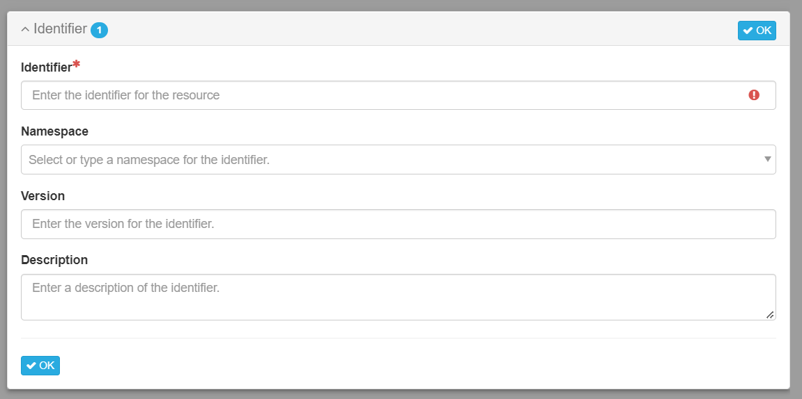
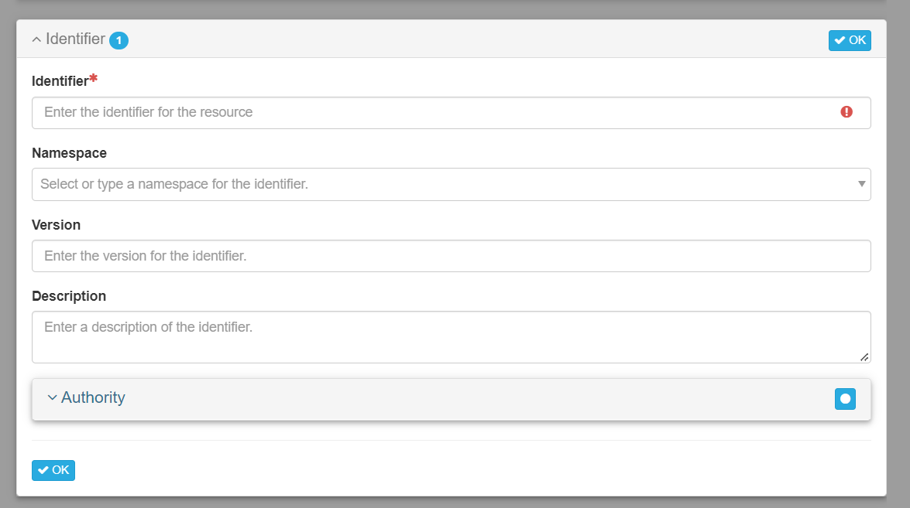
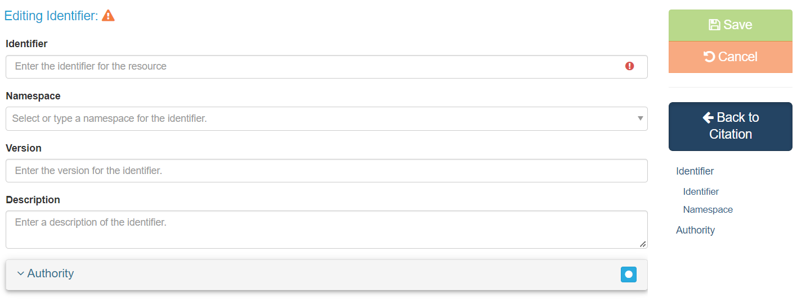

# Creating Profile Definitions for mdEditor
The full profile outline (full-profile-outline.json) provides the full set of fields and sections used in creating profile definitions for the metadata creation program, mdEditor.

Changing the file so that a field is set to "false" will hide that field. Fields that are set to "true" will be displayed. All fields are set to "true" by default, so omitting them from the file will result in the omitted field being displayed. You can set a section to "false" rather than turning off every field individually to remove entire sections.

# Add the Full Profile Outline profile definition to mdEditor
1. Go to Settings/Profiles/Manage Definitions.
2. Select "Add Definition".
3. Select "Imported" tab.
3. Enter URL to profile definition: https://raw.githubusercontent.com/twisneskie/mdEditor-profile-creation/main/full-profile-outline.json
4. Enter an optional alias (the alias replaces the definition title).
5. Select "Save definition". You should receive a notification that the profile has been downloaded and profile information will be displayed on the tab.

# Add profile for use by mdEditor
1. Go to Settings/Profiles.
2. Select "Add Profile".
3. Enter a "Title" (displayed in profile selection field). 1. Select a "Profile Definition" from dropdown list (either the definition title or the alias entered in the previous step will be displayed). 1. And optional description (displayed when cursor hovers over "?" in the profile selection field).
4. Identify a schema from the "Selected Schema" list and select "Add" (NOTE: Skip this step for testing. You will see a "No schemas have been assigned" warning, just ignore that for now!).
5. Select "Save Profile".
Notes: Changes made to a existing profile may not be reflected until the editor is reloaded.

# Known Issues
See [Issues](https://github.com/twisneskie/mdEditor-profile-creation/issues) for the known list of fields and sections that don't function as expected. If you encounter any errors when using the full profile, please submit an Issue.

# Identifiers
mdEditor uses three separate field names to represent identifier sections: "identifier", "identifierSimple", and "identifierShort".

identifierShort is the most obvious difference. It displays fewer fields than identifier or identifierSimple: just Identifier, Namespace, Version, and Description.

Identifier and identifierSimple both show all of the identifier fields (all listed above + authority), but change how mdEditor actually displays them. identifierSimple shows the identifier subsection as a pop-up window.

identifier brings you to a separate page to fill out the subsection.

This full profile outline sets all three types of identifier sections to "true", resulting in three identifier sections when using this profile definition.

In nearly every instance where there is a choice between the three options, identifier will be the default (exceptions include: Taxonomy/Taxonomic System/Citation/Identifier and Documents/Identifier which both have identifierSimple as the default). The default identifier option must be set to "false" when using another identifier style, or both types of identifier options will be shown.
